# CSX_450_1_Project_1 The Data Science Toolkit

## Goal

The purpose of this document is to provide a detailed guide to help in installing and configuring a Jupyter Data Science Notebook Server on Amazon Web Services (AWS). 
It also discusses the following at the end:
- Jupyter Notebook Security Concerns
- Cost of running a notebook server for 3 months  

## Architecture of the System (AWS, Docker, Jupyter)  

Here is a little diagram to help understand the system.

## Pre-requisites:
   Before we get into the nitty-gritty of setting up/configuring the Jupyter Data Science Notebook, we need to go through some basic set up.

1.  ### CREATE AMAZON WEB SERVICES (AWS) ACCOUNT

    Create your AWS account at https://aws.amazon.com/ if you don’t already have one. Note that you will need to provide a phone number to authenticate and complete setting up the account.

2.  ### INSTALL BASH SHELL

    On the Window Operating System, please download and install git-bash from https://git-scm.com/downloads .
On Mac Operating System, no installation is needed, as this is available native. It is the Mac Terminal shell available in the Utilities folder.

    On the Linux OS, this is available native as well.

3.  ### GENERATE SECURE KEYS

    Launch your Bash Shell and follow the steps below to generate secure public/private rsa key pair that will be used to authenticate/connect to our AWS instance. If the rsa key pair already exist at ~/.ssh/, then please skip this step, as you do need to regenerate it.

    **_Step 1:_** In your home directory, create a directory .ssh with command “mkdir .ssh”.

    **_Step 2:_** Navigate into this .ssh directory, with command “cd .ssh”.

    **_Step 3:_** Generate secure keys with command “ssh-keygen”. This command will create 2 files, a public key (id_rsa.pub) and a private key (id_rsa). Please verify these files were generated with command “ls” to list the files.

4)  ### GET GITHUB
    Github is a Version Control and Source Code Management System.

    Create a GitHub account at http://github.com, and fork our class repo at  https://github.com/joshuacook/UCLA_CSX_450_1_2018_W (Links to an external site.)
    To fork, just click the “Fork” button on the top right corner. Forking creates a copy of the project repository in your personal git-hub account. Any changes to your copy will not affect the original class copy.

## Configure EC2 Instance on AWS

Please follow the below steps to configure EC2 on Amazon Web Services (AWS).

  ### **_Step1:_** LOGIN TO AWS.
  Go to https://aws.amazon.com/,  click on “Sign In to the Console” and login.  
  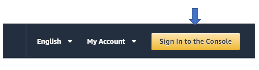

  ### **_Step 2:_** SELECT THE REGION/LOCATION AT WHICH YOU WOULD LIKE TO SET UP YOUR INSTANCE.
  Region dropdown is located on the top right corner. Select the region that is closest to your location or the location from which the services are going to be accessed. Closer the location, faster the service.
  
  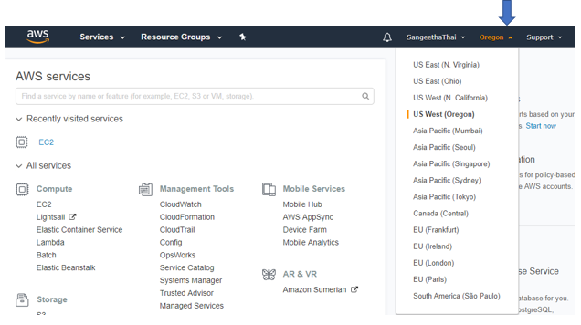

  ### **_Step 3:_** SELECT A SERVICE TYPE. SINCE DATA SCIENCE IS COMPUTATION INTENSIVE, LETS SELECT A COMPUTE SERVICE.
  Let’s select EC2. EC2 stands for Elastic Compute Cloud. EC2 is secure and as the name suggests, resizable compute capacity in the cloud. EC2 is simple to configure and get an instance running in minutes. And importantly, it allows you to scale your capacity up and down as your computing needs change. And you will be billed only for what you use.

  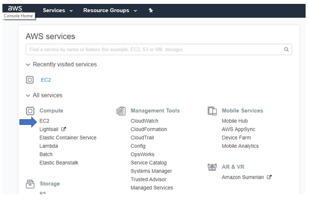

  ### **_Step 4:_** CREATE KEY PAIR
  In the EC2 Dashboard, you will find the link to “Key Pairs” under Resources as well as on the left menu under Network & Security. Click the link to navigate to Key Pairs page.
  
  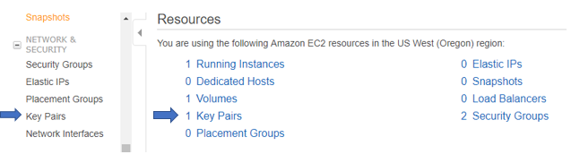
  
  Click on “Import Key Pair” 
  - Enter a Key Pair name 
  - Go to Bash shell location ~/.ssh/ and copy the contents of id_rsa.pub and copy it into the “Public key contents” section.
  
  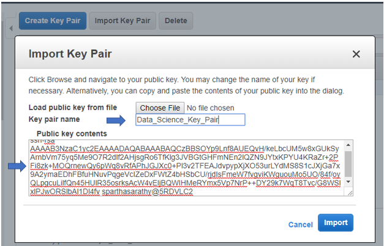
  
  Click “Import”, to save your Key Pair.
 

  When EC2 instance is created, it will use the public key. Bash Shell will be able to connect/login to the EC2 instance using the private key. 
  
  Note that Key Pairs created in one region will not be available in another.

  ### **_Step 5:_** CREATE A SECURITY GROUP
  A Security Group allows us to define a set of rules to control access to the EC2 instance. 

  In the EC2 Dashboard, you can find links to “Security Groups” under Resources as well as in the left menu under Network & Security. Click on “Security Groups” to begin configuring a Security Group
 
  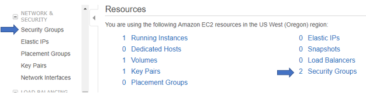

  Let’s create a new security group.
  - Click “Create Security group” and give it a Name and Description.
  
  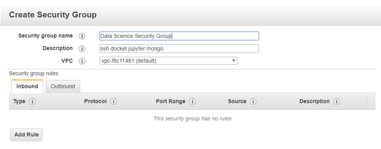
  

  - In the Inbound tab, click “Add Rule” and add rules for services as in the screen shot below.
  Notice that the Source is set to “Anywhere”.
  
  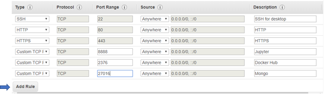

  ### **_Step 6:_** CREATE EC2 INSTANCE (VIRTUAL SERVER)
  Click on “Launch Instance” button, to create your EC2 instance.
  
  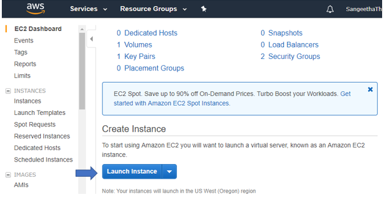 

  ### **_Step 5:_** CHOOSE AN AMAZON MACHINE IMAGE (AMI)
  To Launch an EC2, we need an Operating System (OS), Application Server (App Server) and Applications (Apps). An AMI is a template that is preconfigured with all of these (OS, App. Server and Apps).

  From the available list of AMIs, “Select” Ubuntu Server. 
  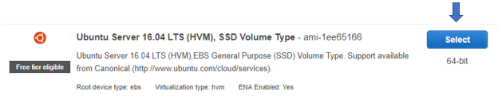
 

  ### **_Step 7:_** CHOOSE AN INSTANCE TYPE.
  Each Instance Type contains varying combinations of CPU, Memory, Storage, Network capacity. Choose the mix that is right for you. 
    
  Let’s select “t2.micro” for our Instance Type and click “Next” to start configuring the Instance details
 
  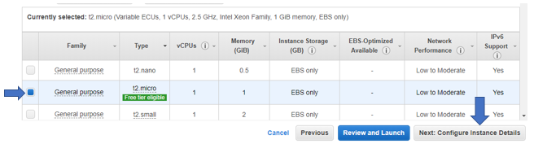 
 

  ### **_Step 8:_** CONFIGURE INSTANCE DETAILS
  This where you choose how many instances you want to run, your network, shutdown behavior, etc. Notice that all fields are populated with default configuration.
  
  Let’s go with the default configuration and click “Next” to move on to add storage.
  
  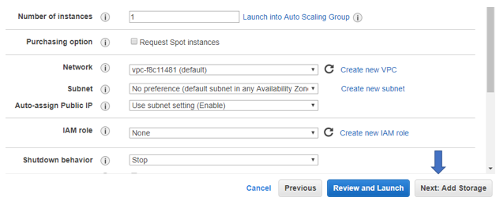
 

  ### **_Step 9:_** ADD STORAGE
  Increase the Storage size to 30 GB. Since we are going to be dealing with Big data, we need to make sure we have adequate storage space to accommodate all the data. Let move on to the next section. Click “Next”.
 
  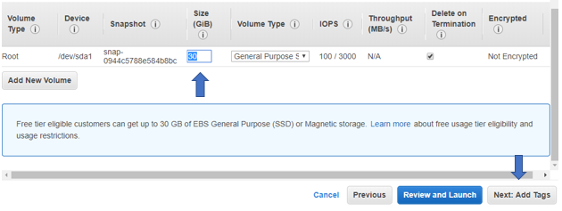
 

  ### **_Step 10:_** ADD TAGS
    
  We are going to skip this section, and click “Next” to move on.
  
  

  ### **_Step 11:_** CONFIGURE SECURITY GROUP
  Choose “Select and existing Security Group” and select the security group we created in the beginning.
 
  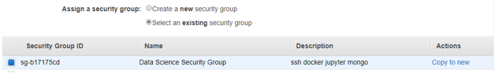 

  Click “Review and Launch”

  ### **_Step 12:_** REVIEW YOUR EC2 INSTANCE CONFIGURATION AND CLICK “LAUNCH”.
  This will bring up a modal window to “Select or Create a Key Pair” (see below). 
  - From the dropdown select “Choose an existing key pair” 
  - Select the Key Pair you created in the beginning
  - Check the acknowledgement
  - And finally click “Launch Instances”
  
  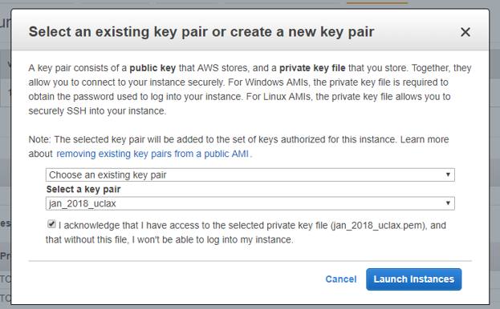
  

  ### **_Step 13:_** CHECK YOU NEWLY CREATED INSTANCE IN THE LIST OF RUNNING INSTANCES. 
  If you are not automatically directed to the list of instances, then
  - click on the AWS Smile on the top menu, to access the EC2 dashboard
  - Select EC2 Service
  - In the EC2 Dashboard, click on either “Running Instances” under Resources or “Instances” under Instances in the left menu.
  
  
 

   **Running Instances**
   You should now see your instance running in the Running Instances section.
    
   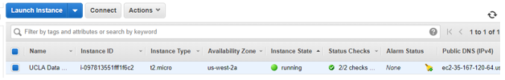

## Configure your EC2 Instance using Docker
Let’s login to our EC2 Instance and download docker.
1.  ### GET YOUR PUBLIC IP ADDRESS FROM THE EC2 INSTANCE YOU CREATED
    Go to Running Instances and select your instance. Note down the IP Address from the description section.
    
    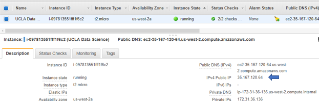
    

2.  ### SSH INTO YOUR EC2 INSTANCE 
    Go to Bash shell and use the command, **ssh username@<public.ip.address>** to securely login to your EC2 Instance

    We chose Ubuntu as our Operating System, and ubuntu’s default user is ubuntu.

    So, translating the above command, it is  **ssh ubuntu@35.16.120.64**

    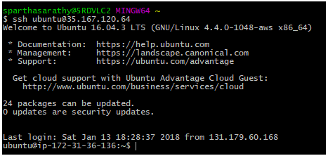

    If you successfully ssh into your instance, you should be at user@ip-private prompt

3.  ### INSTALL DOCKER
    Use **curl** to download docker and pass it to shell.
    
    The command to do so is below.
   
    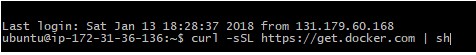

    Once docker installation is complete, you can check the installation with the command, **docker -v**
 
    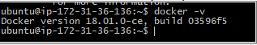
    

4.  ### ADD UBUNTU USER TO DOCKER GROUP
    By default, the docker command line client requires sudo access to issue commands to docker daemon. To allow ubuntu to issue docker commands without sudo, let’s add ubuntu user to docket group. To add ubuntu user to docker group use the command, 

    **sudo usermod -aG docker ubuntu**

5.  ### REBOOT/RECONNECT FOR CHANGES TO TAKE EFFECT
    To disconnect, just use command **exit** and log back into your instance.

## Configure Jupyter Data Science Notebook

1.  ### GET JUPYTER DATA SCIENCE NOTEBOOK
    From Bash shell, 
    -	connect to our EC2 Instance 
        use command: **_ssh ubuntu@ip-address_**
    -	get Jupyter Data Science Notebook image
        use command: **_docker pull jupyter/datascience-notebook_**
    -	Use command **_docker images_** to check Jupyter Data Science Notebook image we just pulled
 
     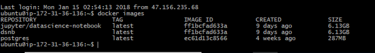
 

2.  ### CREATE THE DOCKER CONTAINER
    To create the docker container use the following command:

    **docker run -v /home/ubuntu:/home/jovyan -p 8888:8888 -d jupyter/datascience-notebook**

    where, **-p** option links amazon port to local port
 	   **-d** option stands for detached, i.e., the process runs in the background

    On successful creation of the docker container, the command output the Container Id of the docker container. (see below)
 
    You can view the docker container you just created with the command docker ps which displays all processes. Screenshot below shows the id of the docker container we created above.
    
    
    
     Note, Container is an instance of an image. What we see below is an instance of Jupiter image we pulled above.
    
     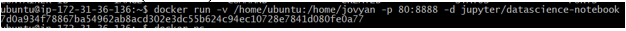
 
 
3.  ### GET THE JUPYTER DATA SCIENCE NOTEBOOK SERVER UP AND RUNNING

    To get the Notebook server up and running, execute the command below.
      
    **docker exec <first-4-letters-of-container-id> Jupiter notebook list**

    On executing the command, it will display a url and token of the notebook that can be used to login to the Jupiter Notebook Server.
   
    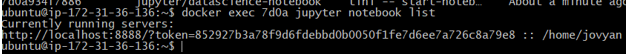

    Launch a browser and type in your EC2 instance’s public IP address. This will display your Jupiter Data Science Notebook.
   Use the token to login to your notebook server on the website.

    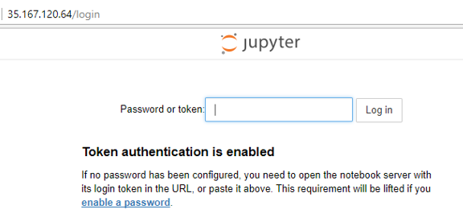

## Jupyter Notebook Security Concerns

1)  In token based authentication, the token can be passed via query parameter, which hackers can steal and gain access to our system.
2)  Once the user logs into the Jupyter Notebook Server, it creates a cookie on the users local machine and stores the password in the cookie. This makes it vulnerable to hackers.
3)  Jupiter Notebook Server’s web interface provides access to terminals. Hackers can launch the terminal and execute all system commands like a logged in user.
4)  Attackers can run arbitrary code from within the notebook and attack the system.

## Cost of running a notebook server for 3 months

On-demand pricing (https://aws.amazon.com/ec2/pricing/on-demand/) for EC2 lets you pay for only running instances and pay for computing capacity by the hour or second without any long-term commitments. So choose to pick this pricing plan.
Based on this plan, for region Oregon, here is my budget:

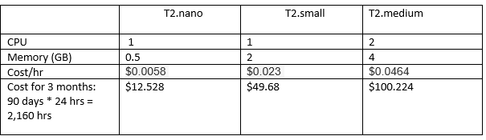  

## Author

**Sangeetha Parthasarathy**
